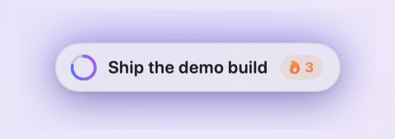

<div align="center">
  
  <h1>Daily Goal</h1>
  <p><strong>One goal. Always in sight.</strong></p>
  <p>A tiny native macOS pill that floats above every window with your one thing for today.</p>
  <p>
    <a href="https://github.com/jpwahle/daily-goal/releases/latest/download/DailyGoal.dmg"><b>Download for macOS</b></a>
    ·
    <a href="https://jpwahle.github.io/daily-goal/"><b>Website</b></a>
  </p>
  <p>
    
    
    
    
  </p>
  <br>
  <picture>
    <source media="(prefers-color-scheme: dark)" srcset="docs/shot-active-dark.png">
    
  </picture>
  <br>
  <picture>
    <source media="(prefers-color-scheme: dark)" srcset="docs/shot-done-dark.png">
    
  </picture>
  <br>
  <picture>
    <source media="(prefers-color-scheme: dark)" srcset="docs/shot-nudge-dark.png">
    
  </picture>
</div>

## Why

Todo apps hold twenty things; your attention holds one. Daily Goal keeps that
one thing floating above every window, every Space, even full-screen apps —
quiet peripheral pressure until it's done. And it never gets in the way: the
pill is click-through, so your mouse acts on whatever is behind it.

## Install

**Download:** grab [`DailyGoal.dmg`](https://github.com/jpwahle/daily-goal/releases/latest/download/DailyGoal.dmg),
drag the app to Applications. Releases are signed with a Developer ID
certificate and notarized by Apple, so macOS opens the app without warnings.

**Or build from source** (macOS 13+, Xcode command line tools):

```bash
git clone https://github.com/jpwahle/daily-goal.git
cd daily-goal
./build.sh --run
```

## How it works

| Function | Interaction |
|---|---|
| Set your goal | An empty pill is plain-clickable: click, type, press **Return** (Esc cancels, clicking away commits). Once a goal is set, hold **⌥** and click the text — or use the menu bar |
| Mark it done | Hold **⌥**, click the ring — spring checkmark, strikethrough, confetti, soft pop |
| Feel the day pass | The ring fills as the day elapses; turns **orange** under 3 h left, **red** under 1 h |
| Click through it | The pill never takes your mouse: clicks land on the window behind it, and hovering fades it to a ghost so you can see what's under it. Hold **⌥** while over it to grab it (a hint under the pill teaches this, then retires). **Click Through** in the menu bar turns it off |
| Stay unobtrusive | The pill fades after ~8 s idle and steps aside on hover |
| Get reminded | **Remind Me** in the menu bar: every 30 min up to every 3 h (default: hourly), or Off. At the Mac, the pill hops and glows violet; away, one macOS notification waits in Notification Center |
| Keep a streak | 🔥 chip appears from 2 consecutive completed days; undo-safe |
| Move it | Hold **⌥** and drag; magnetic snap points at screen thirds, position remembered across launches |
| Menu bar | Icon shows state at a glance (dashed = unset, target = pending, ✓ = done); menu has edit, mark done, last-7-days dots, reminder frequency, hide/show, launch at login, check for updates, quit |
| Stay current | **Check for Updates…** asks GitHub for the latest release; a quiet daily check (on by default, one API call, toggle off with **Check Daily**) surfaces an **Install…** item in the menu when a newer version exists. One click downloads the release from GitHub, verifies its SHA-256 checksum and Developer ID signature, swaps the app in place, and relaunches |

While the pill has keyboard focus: **Return** edits, **Space** toggles done,
**⌘Q** quits.

## Design decisions

- **Days flip at 4 a.m.**, not midnight — finishing at 1 a.m. still counts for
  the evening it belongs to. On rollover the goal archives and the pill
  invites you to set the next one (it reappears even if hidden).
- **Never steals focus — or clicks.** The panel is non-activating, and by
  default it ignores the mouse entirely: every click goes to the window
  behind it. The pill only catches the mouse while you hold **⌥** over it,
  while it's empty and waiting for a goal, or while you're editing.
- **The streak only survives honest completion.** Miss a day and it's gone;
  un-checking restores the exact pre-completion state.
- **Reminders nag politely.** They skip while you're editing, stop the moment
  the goal is done, and restart their countdown whenever you touch the goal.
  Away from the keyboard for a few minutes, the nudge becomes a notification —
  which replaces the previous one instead of stacking, and respects Focus modes.
- **No accounts, no telemetry.** State lives in `UserDefaults`
  (`org.gipplab.dailygoal`), including a 90-day history; reminders are local
  notifications, generated on your Mac. The app only ever talks to GitHub:
  one API call asks for the latest version number
  ([UpdateChecker.swift](Sources/DailyGoal/UpdateChecker.swift)) — at most
  once a day, nothing sent beyond the request, and **Check Daily** in the menu
  turns it off. Updates never install behind your back: only when you click
  **Install**, the release downloads from GitHub and must pass two independent
  checks before it replaces the app — the SHA-256 checksum published with the
  release, and a valid Developer ID signature for this app's team and bundle ID
  ([UpdateInstaller.swift](Sources/DailyGoal/UpdateInstaller.swift)).

## Project layout

```
Sources/DailyGoal/
  main.swift              app bootstrap (accessory activation policy)
  AppDelegate.swift       panel placement, day-rollover timer, frame persistence
  FloatingPanel.swift     non-activating always-on-top NSPanel + view bridge
  PillInteraction.swift   click-through mode machine: passive / ghost / ⌥-live
  GoalStore.swift         state machine: logical days, streaks, history
  GoalView.swift          the pill: check ring, confetti, idle dimming, nudge bounce
  StatusBarController.swift  menu bar icon + menu
  ReminderCenter.swift    reminder timer: pill bounce at the Mac, notification when away
Scripts/MakeIcon.swift    renders the .icns at build time
Scripts/create-dmg.sh     styled drag-to-Applications DMG
Scripts/MakeDMGBackground.swift  renders the DMG window background (arrow + hint)
Scripts/make-shots.sh     regenerates docs/ screenshots from the real app (Retina, light+dark)
docs/                     landing page (GitHub Pages)
build.sh                  dev build: compile → bundle → sign (ad-hoc)
Makefile                  release: universal build → sign → notarize → DMG
```

## Releasing

Every push to `main` triggers the [release workflow](.github/workflows/release.yml):
it bumps the version from conventional-commit prefixes, builds a universal
binary, signs it with the Developer ID certificate, notarizes and staples both
the app and the DMG, and publishes a GitHub release. Locally the same pipeline
runs with:

```bash
make release-dmg VERSION=1.0.1 \
  SIGNING_IDENTITY="Developer ID Application: Jan Philip Wahle (S5NQXKYPKT)" \
  APPLE_ID=you@example.com TEAM_ID=S5NQXKYPKT KEYCHAIN_PROFILE=AC_PASSWORD
```

## License

[MIT](LICENSE) © Jan Philip Wahle
