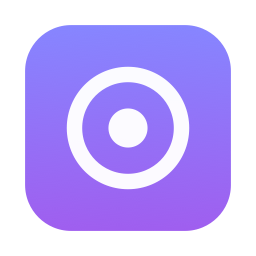
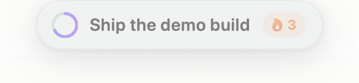
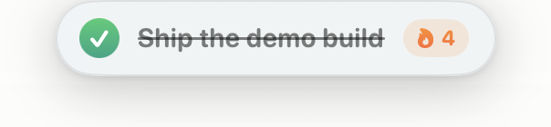

<div align="center">
  
  <h1>Daily Goal</h1>
  <p><strong>One goal. Always in sight.</strong></p>
  <p>A tiny native macOS pill that floats above every window with your one thing for today.</p>
  <p>
    <a href="https://github.com/jpwahle/daily-goal/releases/latest/download/DailyGoal.dmg"><b>Download for macOS</b></a>
    ·
    <a href="https://jpwahle.github.io/daily-goal/"><b>Website</b></a>
  </p>
  <p>
    
    
    
    
  </p>
  <br>
  
  <br>
  
</div>

## Why

Todo apps hold twenty things; your attention holds one. Daily Goal keeps that
one thing floating above every window, every Space, even full-screen apps —
quiet peripheral pressure until it's done.

## Install

**Download:** grab [`DailyGoal.dmg`](https://github.com/jpwahle/daily-goal/releases/latest/download/DailyGoal.dmg),
drag the app to Applications. The app is signed locally but not notarized
(no paid developer account for a 1 MB pill), so on first launch macOS will
warn — allow it under **System Settings → Privacy & Security → Open Anyway**,
or clear the flag yourself:

```bash
xattr -d com.apple.quarantine "/Applications/Daily Goal.app"
```

**Or build from source** (macOS 13+, Xcode command line tools):

```bash
git clone https://github.com/jpwahle/daily-goal.git
cd daily-goal
./build.sh --run
```

## How it works

| Function | Interaction |
|---|---|
| Set your goal | Click the pill, type, press **Return** (Esc cancels, clicking away commits) |
| Mark it done | Click the ring — spring checkmark, strikethrough, confetti, soft pop |
| Feel the day pass | The ring fills as the day elapses; turns **orange** under 3 h left, **red** under 1 h |
| Stay unobtrusive | The pill fades after ~8 s idle, brightens instantly on hover |
| Keep a streak | 🔥 chip appears from 2 consecutive completed days; undo-safe |
| Move it | Drag the pill by its edge; position is remembered across launches |
| Menu bar | Icon shows state at a glance (dashed = unset, target = pending, ✓ = done); menu has edit, mark done, last-7-days dots, hide/show, launch at login, quit |

While the pill has keyboard focus: **Return** edits, **Space** toggles done,
**⌘Q** quits.

## Design decisions

- **Days flip at 4 a.m.**, not midnight — finishing at 1 a.m. still counts for
  the evening it belongs to. On rollover the goal archives and the pill
  invites you to set the next one (it reappears even if hidden).
- **Never steals focus.** The panel is non-activating: clicking or typing in
  it doesn't deactivate the app you're working in.
- **The streak only survives honest completion.** Miss a day and it's gone;
  un-checking restores the exact pre-completion state.
- **No accounts, no network.** State lives in `UserDefaults`
  (`org.gipplab.dailygoal`), including a 90-day history. There is no network
  code in the app.

## Project layout

```
Sources/DailyGoal/
  main.swift              app bootstrap (accessory activation policy)
  AppDelegate.swift       panel placement, day-rollover timer, frame persistence
  FloatingPanel.swift     non-activating always-on-top NSPanel + view bridge
  GoalStore.swift         state machine: logical days, streaks, history
  GoalView.swift          the pill: check ring, confetti, idle dimming
  StatusBarController.swift  menu bar icon + menu
Scripts/MakeIcon.swift    renders the .icns at build time
docs/                     landing page (GitHub Pages)
build.sh                  compile → bundle → sign (ad-hoc)
```

## License

[MIT](LICENSE) © Jan Philip Wahle
